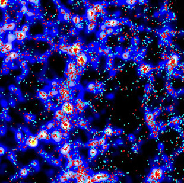

Documentation for ELUCID Project
================================

This repository hosts the documentation written for the ELUCID project (ses Wang et al. 2016, [arXiv:1608.01763](https://arxiv.org/abs/1608.01763) for a review).
The project description, data access description, data specification, and 
other related topics will be presented. 

The documentation is still under construction. If interested in either the 
data or the usage of it, please contact Yangyao Chen [yangyaochen.astro@foxmail.com](mailto:yangyaochen.astro@foxmail.com)) for details.

