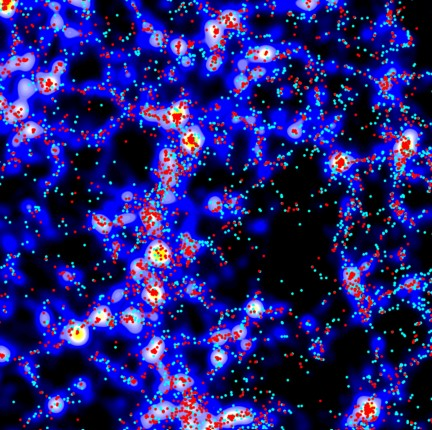

.. ELUCID documentation master file, created by
   sphinx-quickstart on Thu Aug 26 14:52:54 2021.
   You can adapt this file completely to your liking, but it should at least
   contain the root `toctree` directive.

The ELUCID Project
===================

.. toctree::
   :maxdepth: 2

   docs/about/index
   docs/data/index
   docs/data/access